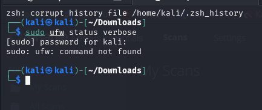
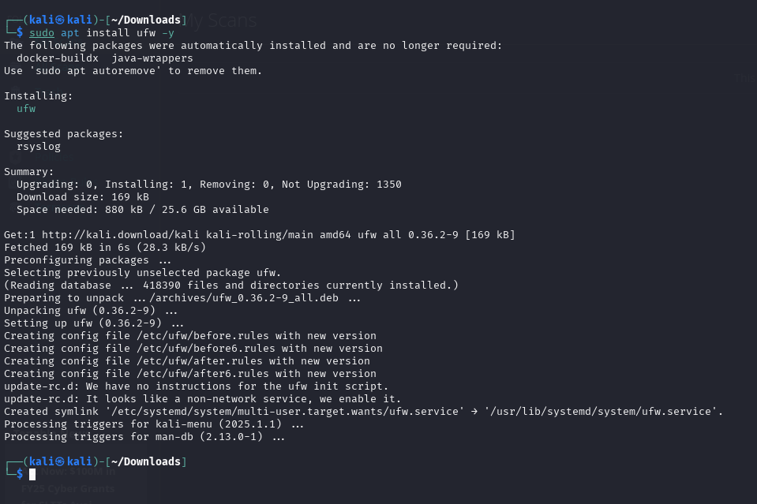
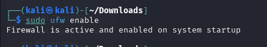
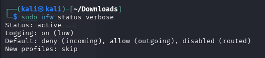
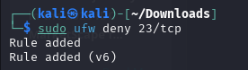
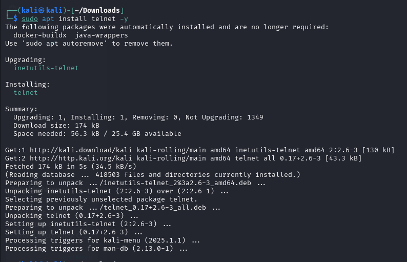
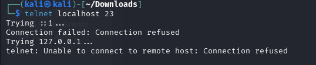
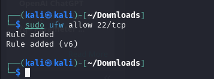
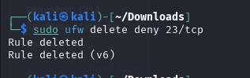

# cybare-Internship-Elevatelabs-task4

##Task 4 - Setup and Use a Firewall on Windows/Linux
--

### Objective: 

Configure and test basic firewall rules to allow or block traffic.

### Tools: 

Windows Firewall / UFW (Uncomplicated Firewall) on Linux.

### Deliverables: 

Screenshot/configuration file showing firewall rules applied.

### Solutions:

#### Step 1:- Check if UFW is installed

sudo ufw status verbose

sudo apt install ufw -y 

#### Step 2:- Enable UFW

sudo ufw enable

#### Step 3:- current rules (for screenshot #1)

sudo ufw status verbose

#### Step 4:- Block inbound Telnet (port 23)

sudo ufw deny 23/tcp

This creates a rule to block all TCP traffic on port 23.

#### Step 5:- Test the block

Install telnet client if not already present:

sudo apt install telnet -y

Attempt to connect:

telnet localhost 23

Expected result: Connection refused or Unable to connect.

#### Step 6:- Allow SSH (port 22)

sudo ufw allow 22/tcp

This ensures you don’t lock yourself out if connecting remotely.

#### Step 7:- Remove the Telnet block

sudo ufw delete deny 23/tcp

#### Step 8:- Final rule list (for screenshot #2)

sudo ufw status verbose

#### Summarize how firewall filters traffic.

A firewall filters traffic by examining each network packet that enters or leaves a system and comparing it against a set of predefined rules.

Inbound filtering checks data coming into the system and blocks unwanted or harmful traffic before it reaches applications.

Outbound filtering controls what traffic leaves the system, preventing unauthorized data from being sent out.

Rules can match based on IP address, port number, protocol (TCP/UDP), or even application type.

-- If a packet matches an allow rule, it passes through.

-- If it matches a deny/block rule, the firewall drops it without delivering it.

-- If no rule matches, the default policy (allow or deny) is applied.

In short: a firewall acts like a security guard at a network gate — it checks each “visitor” (packet) against its guest list (rules) and only lets approved ones in or out.
